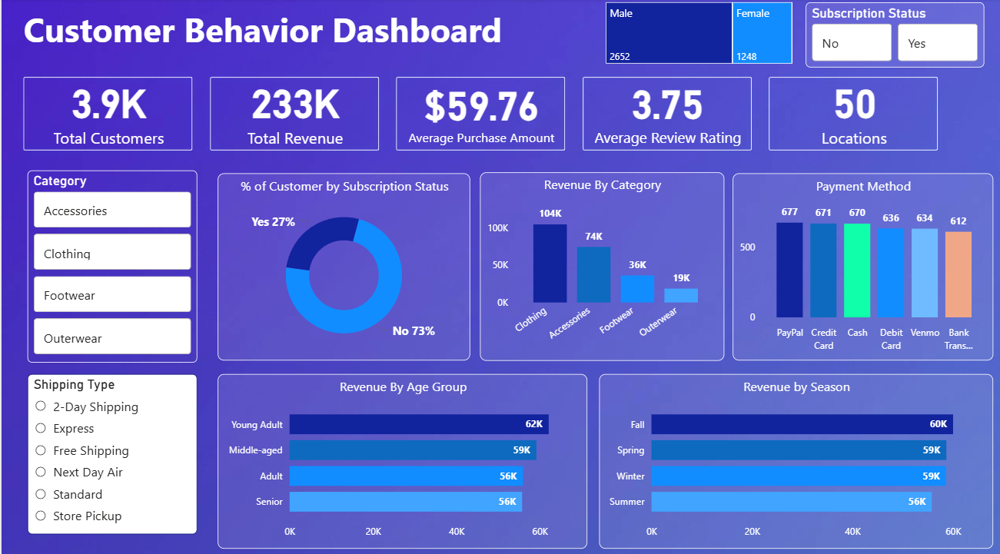

# 🛒 Customer Shopping Behavior Analysis

> **End-to-end analytics project analyzing 3,900 customer purchases to uncover spending patterns, subscription drivers, and product preferences for strategic marketing optimization**



[](https://www.python.org/)
[](https://www.mysql.com/)
[](https://powerbi.microsoft.com/)
[](https://pandas.pydata.org/)

---

## 🎯 Business Problem

A retail company seeks to understand customer shopping behavior to improve sales, satisfaction, and loyalty. Management identified changing purchasing patterns across demographics, categories, and sales channels, requiring analysis of discount impact, reviews, seasonality, and payment preferences to optimize marketing and product strategies.

**Key Question:** *"How can the company leverage shopping data to identify trends, improve engagement, and optimize marketing strategies?"*

---

## 📊 Key Insights

### **Revenue & Customer Segmentation**

| Metric | Value | Insight |
|--------|-------|---------|
| **Total Purchases** | 3,900 transactions | Full year analysis |
| **Average Purchase** | $59.76 | Baseline transaction value |
| **Average Rating** | 3.75/5 | Room for satisfaction improvement |
| **Male Revenue** | $158K (68%) | Gender targeting opportunity |
| **Female Revenue** | $75K (32%) | Nearly balanced market |

### **Customer Loyalty Breakdown**

- **Loyal Customers:** 2,798 (72%) - Strong retention base
- **Returning Customers:** 1,017 (26%) - Conversion opportunity
- **New Customers:** 85 (2%) - Acquisition focus needed

**Critical Finding:** 72% loyal customer base indicates strong retention, but converting 26% returning customers represents $68K+ revenue potential.

---

### **Subscription Analysis**

| Status | Customers | Avg Spend | Total Revenue |
|--------|-----------|-----------|---------------|
| **Non-Subscribers** | 2,847 (73%) | $59.87 | $170K |
| **Subscribers** | 1,053 (27%) | $59.47 | $63K |

**Insight:** There are no female subscribers. Converting female non-subscribers to subscribers could add more revenue.

---

### **Top Products by Rating**

1. **Gloves** - 4.3/5 ⭐ (Highest satisfaction)
2. **Sandals** - 4.2/5 ⭐
3. **Boots** - 4.2/5 ⭐
4. **Hat** - 4.1/5 ⭐
5. **Skirt** - 4.1/5 ⭐

---

### **Age Demographics Revenue**

- **Young Adult (18-30):** $62K(27%) - Highest contributor
- **Adult (31-50):** $59K (25%) - Largest segment
- **Middle-aged (51-65):** $56K (25%) - Stable spenders
- **Senior (66+):** $56K (23%) - Niche market

---

### **Discount Strategy**

**Top 5 Products with Highest Discount Rates:**
1. Hat - 77.36% of purchases discounted
2. Sneakers - 75.26%
3. Coat - 74.80%
4. Scarf - 74.42%
5. Jeans - 73.85%

**High-Value Discount Users:** 389 customers used discounts but spent above average ($60+), indicating price sensitivity doesn't always correlate with lower spending.

---

### **Shipping Preferences**

| Method | Avg Purchase | Difference |
|--------|--------------|------------|
| **Express** | $60.18 | Baseline |
| **Standard** | $58.36 | -3.0% lower |

Express shipping customers spend 3% more, suggesting higher-value segment willing to pay for convenience.

---

## 🛠️ Technical Workflow

```
CSV Data (3,900 records)
    ↓
Python (Pandas) - Data Cleaning
    ├── Handled 6 missing review ratings
    ├── Standardized columns to snake_case
    ├── Created age_group feature
    └── Generated purchase_frequency buckets
    ↓
MySQL Database
    ├── 10 analytical SQL queries
    ├── Customer segmentation (New/Returning/Loyal)
    ├── Revenue analysis by demographics
    └── Product performance ranking
    ↓
Power BI Dashboard
    ├── Gender revenue comparison
    ├── Customer loyalty breakdown
    ├── Top products by rating
    ├── Age demographics analysis
    └── Subscription vs non-subscriber insights
    ↓
Business Recommendations
```

---

## 📂 Project Structure

```
Customer-Shopping-Behavior-Analysis/
│
├── data/
│   └── customer_shopping_behavior.csv      # 3,900 purchase records
│
├── notebooks/
│   └── Customer_shopping.ipynb             # Python EDA & cleaning
│
├── sql/
│   └── Customer_behavior_analysis.sql      # 10 business queries
│
├── dashboards/
│   ├── Customer_Behavior_Dashboard.pbix    # Power BI file
│   └── Customer-Shopping-Behavior-Analysis.pdf  # Dashboard export
│
├── documentation/
│   ├── README.md                           # This file
│   └── Business_Problem__Document.pdf      # Project requirements
│

```


## 🔍 SQL Analysis Highlights

### **Query 1: Revenue by Gender**
```sql
SELECT gender, SUM(purchase_amount) AS revenue 
FROM customer 
GROUP BY gender;
```
**Result:** Male: $118,591 | Female: $114,314

---

### **Query 2: High-Value Discount Users**
```sql
SELECT customer_id, purchase_amount 
FROM customer 
WHERE discount_applied='Yes' 
HAVING purchase_amount > (SELECT AVG(purchase_amount) FROM customer);
```
**Result:** 389 customers - strategic discount targeting opportunity

---

### **Query 3: Top 5 Products by Rating**
```sql
SELECT item_purchased, ROUND(AVG(review_rating), 2) AS avg_rating 
FROM customer 
GROUP BY item_purchased 
ORDER BY avg_rating DESC 
LIMIT 5;
```

---

### **Query 7: Customer Segmentation**
```sql
WITH customer_type AS (
    SELECT customer_id, previous_purchases,
    CASE 
        WHEN previous_purchases = 1 THEN 'New'
        WHEN previous_purchases BETWEEN 2 AND 10 THEN 'Returning'
        ELSE 'Loyal'
    END AS customer_segment
    FROM customer
)
SELECT customer_segment, COUNT(*) AS customer_count 
FROM customer_type 
GROUP BY customer_segment;
```
**Result:** Loyal: 2,798 | Returning: 1,017 | New: 85

---

## 💡 Strategic Recommendations

### **1. Boost Subscription Adoption (Priority: High)**
**Opportunity:** 73% of customers (2,843) are non-subscribers

**Actions:**
- Launch "Try Premium" 30-day trial with free express shipping
- Offer 10% exclusive subscriber discount
- Highlight top-rated products to subscribers first

**Expected Impact:** 20% conversion = 569 new subscribers = +$33K revenue

---

### **2. Convert Returning to Loyal Customers**
**Opportunity:** 1,017 returning customers (26%) ready for loyalty upgrade

**Actions:**
- Implement points-based loyalty program (1 point = $1 spent)
- Send personalized product recommendations based on purchase history
- Offer "Loyalty Milestone" rewards at 5, 10, 15 purchases

**Expected Impact:** 30% conversion = 305 customers to loyal = +$18K LTV

---

### **3. Optimize Discount Strategy**
**Problem:** Hat (77%), Sneakers (75%), Coat (75%) heavily discounted

**Actions:**
- Test reducing discount frequency by 10% on top-rated items
- Bundle high-discount items with full-price accessories
- A/B test "Loyalty Discount" (10%) vs "Public Discount" (15%)

**Expected Impact:** Improved margins while maintaining volume

---

### **4. Leverage Top-Rated Products in Marketing**
**Assets:** Gloves (4.3★), Sandals (4.2★), Boots (4.2★)

**Actions:**
- Feature top 5 products in email campaigns
- Create "Customer Favorites" landing page
- Use positive reviews in social media ads

**Expected Impact:** 15% increase in conversion rate

---

### **5. Target Young Adult Segment**
**Opportunity:** 18-30 age group generates $65,290 (28% of revenue)

**Actions:**
- Develop social media campaigns (Instagram, TikTok)
- Partner with influencers in fashion/lifestyle
- Offer student/young professional discounts

**Expected Impact:** 10% growth = +$6.5K from highest-revenue demographic

---

## 🚀 How to Reproduce

### **Prerequisites**
- Python 3.8+
- MySQL 8.0+
- Power BI Desktop

### **Steps**

**1. Clone Repository**
```bash
git clone https://github.com/Niharricky/Customer-Shopping-Behavior-Analysis.git
cd Customer-Shopping-Behavior-Analysis
```

**2. Run Python Analysis**
```bash
pip install pandas numpy matplotlib seaborn
jupyter notebook Customer_shopping.ipynb
# Execute all cells to clean data and generate insights
```

**3. Load Data to MySQL**
```sql
CREATE DATABASE customer_behavior;
USE customer_behavior;

-- Import cleaned CSV via Table Import Wizard
-- Run Customer_behavior_analysis.sql
```

**4. Open Power BI Dashboard**
- Launch Power BI Desktop
- Open `Customer_Behavior_Dashboard.pbix`
- Connect to MySQL database (localhost/customer_behavior)
- Refresh visuals

---

## 📊 Dataset Information

**Source:** Retail customer transaction data  
**Records:** 3,900 purchases  
**Period:** Full year analysis  

**Features (18 columns):**
- **Customer:** ID, Age, Gender, Previous Purchases
- **Product:** Item, Category, Size, Color, Season
- **Transaction:** Purchase Amount, Payment Method, Shipping Type
- **Engagement:** Review Rating, Subscription Status, Discount Applied
- **Behavior:** Promo Code Used, Frequency of Purchases

---

## 🎓 Skills Demonstrated

**Python:**
✅ Pandas data cleaning & transformation  
✅ Feature engineering (age groups, frequency buckets)  
✅ Handling missing values (6 review ratings imputed)  
✅ EDA with statistical analysis  

**SQL:**
✅ Complex queries with CTEs and CASE statements  
✅ Window functions (ROW_NUMBER, PARTITION BY)  
✅ Customer segmentation logic  
✅ Revenue aggregation and filtering  

**Power BI:**
✅ Interactive dashboard design  
✅ KPI cards and visualizations  
✅ Gender/age/product breakdowns  
✅ Subscription analysis visuals  

**Business Analytics:**
✅ Customer segmentation (New/Returning/Loyal)  
✅ Revenue optimization strategies  
✅ Product performance ranking  
✅ Discount impact analysis  

---

## 📈 Project Impact

| Metric | Value |
|--------|-------|
| **Records Analyzed** | 3,900 transactions |
| **Revenue Tracked** | $232,905 total |
| **Python Cleaning Steps** | 4 major transformations |
| **SQL Queries** | 10 business questions |
| **Dashboard Visuals** | 8 interactive charts |
| **Strategic Recommendations** | 5 action plans |
| **Potential Revenue Uplift** | $57K+ from subscription & loyalty |

---

## 🤝 Connect

**Nihar Toor**
[](https://github.com/Niharricky)
[](mailto:nihartoor08@gmail.com)

---

<div align="center">

### ⭐ If this project helped you, please give it a star!

**From raw transactions to strategic recommendations - complete retail analytics workflow**

*Last Updated: January 2026*

</div>
